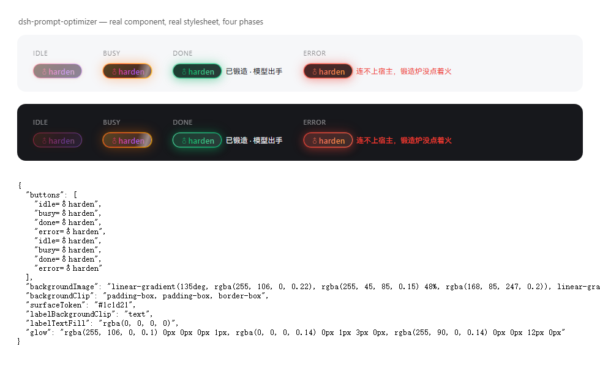

# ♂harden

> 草稿扔进去，出来的是作战指令。**你的要求一条不丢，废话一句不留。**
>
> A hard-boiled prompt rewriter for the DeepSeek Harness composer.

[](https://github.com/asdnmy123/dsh-prompt-optimizer/actions/workflows/selftest.yml)




---

## 30 秒看懂

DSH 对话输入框左下角多出一个 **`♂harden`** 按钮。点它：

```
你的草稿  →  模型重写  →  硬汉任务书  →  直接写回输入框
```

**不改你的意思，只换你的口气。** 先看再发，不自动发送。

规矩钉死，一个字都不许变：

- 按钮文字恒为 **`♂harden`** —— `♂`(U+2642) + `harden`，共七个字符。四个状态（空闲/锻造中/成功/失败）**全用这一个字**：不换字、不加符号、不改大小写、不翻译。
- 事实全保真：交付物、技术栈、版本、尺寸、数量、时间、格式、"不许碰什么"，一条不落。
- 不编新事实：不新增原文没有的步骤、指标、库名、人名。
- 原文什么语言，输出什么语言。
- 模型挂了也有本地兜底 —— 按钮永远有产出，绝不给你一个干瞪眼的错误框。
- **零第三方运行时依赖**：宿主半只用 DSH 公开契约，客户端半只吃 `react`。

---

## 硬汉长什么样（真实对照）

本机 `commandcode / deepseek/deepseek-v4.1-flash-fast`，3.4 秒：

> **进**：写一个 Python 脚本，把目录里的图片压缩到 500KB 以内；要求不改文件名，支持 jpg/png
>
> **出**：
> 哥们，直接给我整个 Python 脚本出来，别整虚的！
> 硬指标就这几条，一条都不许漏：
> - 用 Python 写，一个脚本，写完就能跑。
> - 把当前目录里的 jpg 和 png 图片全给我压了。
> - 压完每张图都得在 500KB 以内，超一点都不行。
> - 文件名不许改，原来叫啥现在还叫啥，一个字都不能动。
>
> 别墨迹，别搞半成品，别留 TODO……交活儿之前自己先逐条核一遍……冲冲冲！
> 哥们，这活儿性命攸关，写漂亮点，一次性交付，给我硬邦邦的，耍起耍起！

**提炼出来的风格骨架**：动员开场 → 硬指标清单 → 自我验收 → 催命收尾。
人称「哥们/老哥」，短句命令式（「直接给我整一个」「别整虚的」「怎么狠怎么来」），强度词管够（硬邦邦、雷霆炫酷、细节拉满、性能榨干、肌肉集团、冲冲冲、耍起耍起），反墨迹（禁止磨叽、禁止无谓独立审查、禁止半成品/占位符/TODO、一次性交付），能并行就并行。

---

## 按钮状态

| 状态 | 长什么样 | 说明 |
|---|---|---|
| 输入框为空 | 胶囊降透明度 | 禁用；悬停提示「输入框是空的，先写点东西哥们」 |
| 空闲 | 流动热渐变环（橙→玫红→紫→金）+ 渐变文字 + 静态辉光 | 可点 |
| 锻造中 | 环流速拉快（1.15s）+ 呼吸辉光 + 高光扫过 + 文字渐变走字 | 禁用防连点；文字仍是 `♂harden` |
| 成功 | 青绿渐变环 + 一次弹跳 + 常亮绿辉光 | 结果已写回输入框，右侧小字「已锻造 · 模型出手」 |
| 失败 | 火红渐变环 + 一次抖动 | 右侧小字写原因 |

---

## 安装

### 前置

| 要什么 | 怎么确认 |
|---|---|
| DSH 跑得起来（桌面版或 CLI 版） | 能打开对话界面 |
| Node ≥ 18 | `node -v` |
| Git（走 GitHub 直装才要） | `git --version` |

### 路子一：从 GitHub 直装（最快）

**桌面版（Electron）** —— 桌面版的 profile 由应用独占管理，`dsh` CLI 碰不得，所以走界面：

1. 打开 DSH → **设置 → 插件**
2. 在安装框里粘这一行，确认：

   ```
   github:asdnmy123/dsh-prompt-optimizer
   ```

3. 装完**刷新页面**（`Ctrl+R`），输入框左下角就该有 `♂harden`。

**CLI 版（非 Electron 托管的 profile）**：

```powershell
dsh plugin --profile <你的-profile> add github:asdnmy123/dsh-prompt-optimizer
```

### 路子二：本机目录（开发用，改代码即时生效）

```powershell
# 1. 拉到本地
git clone https://github.com/asdnmy123/dsh-prompt-optimizer.git D:\dsh-plugins\dsh-prompt-optimizer

# 2A. CLI 版：link 进去
dsh plugin --profile <你的-profile> add link:D:\dsh-plugins\dsh-prompt-optimizer

# 2B. 桌面版：设置 → 插件 → 安装框里粘
#     link:D:\dsh-plugins\dsh-prompt-optimizer
```

`link:` 装的是**活目录**：改 `client.js` / `index.js` 立即生效，不用重装。

### 路子三：手动挂（硬核，不问任何工具）

不用 CLI、不用界面，直接改 profile 文件：

1. clone 到任意目录，比如 `D:\dsh-plugins\dsh-prompt-optimizer`
2. 找到 profile 目录：
   - Windows：`C:\Users\<你>\.dsh\profiles\<profile>\`
   - 桌面版 profile 名一般就叫 `desktop`
3. 编辑该目录下的 `package.json`：

   ```json
   {
     "dependencies": {
       "dsh-prompt-optimizer": "link:D:/dsh-plugins/dsh-prompt-optimizer"
     },
     "dsh": {
       "profile": {
         "bundles": [
           "@deepseek-ai/dsh-base",
           "@deepseek-ai/dsh-web-app",
           "dsh-prompt-optimizer"
         ]
       }
     }
   }
   ```

   **两处都要加**：`dependencies` 让它装得上，`bundles` 让它挂得进。

4. 在 profile 目录里装依赖：

   ```powershell
   cd $env:USERPROFILE\.dsh\profiles\<profile>
   pnpm install
   ```

5. **重启 DSH**（手动挂不吃热重载）。

### 装完自己验一遍（三步，硬证据）

```powershell
# 1. 宿主半活着吗？（端口换成你 DSH 的实际端口）
curl.exe http://127.0.0.1:19387/dsh-prompt-optimizer/health
# → {"ok":true,"plugin":"dsh-prompt-optimizer","version":"0.1.0","style":"hard","localFallback":true}

# 2. 插件在不在清单里
dsh plugin --profile <你的-profile> list

# 3. 眼见为实
#    刷新页面 → 输入框左下角有 ♂harden → 写几个字 → 点它 → 3~6 秒后草稿被改写
```

### 卸载

```powershell
dsh plugin --profile <你的-profile> remove dsh-prompt-optimizer
```

桌面版：**设置 → 插件 → 找到 `dsh-prompt-optimizer` → 移除**，然后刷新页面。
手动挂的：把 `package.json` 里那两处删掉，`pnpm install`，重启。

### 装不上，查这里

| 症状 | 病根 | 干法 |
|---|---|---|
| `profile "desktop" is managed exclusively by the Electron application` | 桌面版 profile 只认应用内管理器 | 别用 CLI，走 **设置 → 插件** |
| 装完没按钮 | 客户端半没重新加载 | **刷新页面**（`Ctrl+R`）；不行就重启 DSH |
| 按钮灰的、点不动 | 输入框是空的 | 先写字 |
| `{"ok":false,"error":{"code":"NO_ADAPTER"}}` | 没有可用模型路由 | 在配置里显式写 `provider` / `model`，或留着 `localFallback: true` 让本地兜底顶上 |
| `{"code":"unknown-plugin"}` | 插件名/profile 写错 | 名字就是 `dsh-prompt-optimizer`，一字不差 |
| 装完还是老样子 | 改的是宿主半… | 宿主半改动要在插件管理器里**关掉再打开**；客户端半改动刷新页面 |
| `dsh` 里找不到插件 | profile 名不对 | `dsh plugin --profile <名> list` 逐个试 |

---

## 怎么用

1. 在对话输入框写你的草稿（多糙都行）。
2. 点 **`♂harden`**。
3. 等 3~6 秒（按钮进「锻造中」）。
4. 结果已在输入框里 —— **看完再发**。不满意就 `Ctrl+Z`，编辑器自带撤销。

想换口味：配置里 `style` 改 `hard` / `team` / `cool`，或在 HTTP 调用里带 `"style": "team"`。

| 口味 | 侧重 |
|---|---|
| `hard` | 纯硬汉直给（默认） |
| `team` | 肌肉集团总动员：拆成可并行的几块、成员自己起炫酷名字、分开干再拼装。原文没提团队时只说「能并行就并行」，不编成员名 |
| `cool` | 雷霆炫酷：视觉/体验类要求强调拉爆、榨干、严丝合缝，但不新增具体参数 |

---

## 配置

配置写在 profile 的 loader row 上（`cordis.patch.yml`）：

```yaml
- insert:
    - id: dsh-prompt-optimizer
      name: dsh-prompt-optimizer
      config:
        style: hard            # hard | team | cool
        provider: ''           # 留空 = 用当前 agent 默认模型
        model: ''              # 与 provider 同时给才生效
        maxTokens: 1600
        temperature: 0.9
        timeoutMs: 180000
        maxInputChars: 20000
        maxConcurrent: 4
        localFallback: true    # 模型不可用时仍给本地兜底
        styleHint: ''          # 追加口气要求，比如「多用军事比喻」
```

| 字段 | 默认 | 含义 |
|---|---|---|
| `style` | `hard` | 口味；非法值回落到 `hard` |
| `provider` / `model` | 空 | 显式模型路由。留空则依次试 `ctx.agentDefaultModel` → 适配器目录里第一个有模型的 route |
| `maxTokens` | `1600` | 单次输出上限 |
| `temperature` | `0.9` | 采样温度（0–2） |
| `timeoutMs` | `180000` | 单次调用超时，超时中止 |
| `maxInputChars` | `20000` | 草稿字符上限，超了 413 |
| `maxConcurrent` | `4` | 并发上限，超了 429 |
| `localFallback` | `true` | 模型失败时是否本地兜底；关掉就把错误抛给界面 |
| `styleHint` | 空 | 追加口气要求，拼在系统提示词末尾 |

---

## HTTP 面（宿主半）

同源、无鉴权（与 DSH 其它插件控制面一致）：

```
GET  /dsh-prompt-optimizer/health
     → { ok, plugin, version, style, localFallback }

POST /dsh-prompt-optimizer/optimize
     body: { "text": "<草稿>", "style": "hard|team|cool" }
     → { ok: true, text, engine: "llm"|"local", route: { provider, model }|null, ms, warning? }
     → { ok: false, error: { code, message } }
```

错误码：`EMPTY_INPUT`(400)、`INPUT_TOO_LONG`(413)、`BAD_JSON`(400)、`BUSY`(429)、`NOT_FOUND`(404)；模型侧失败原样带出 provider-neutral code（`NO_ADAPTER` / `RATE_LIMIT` / `CONTEXT_WINDOW_EXCEEDED`…，502）。

两条降级路径：

1. **模型可用** → `ctx.llm.stream()` 流式锻造，取 `text-delta` 拼文本，读 `finish.reason` 判成败。
2. **模型不可用/报错**（默认开 `localFallback`）→ **本地确定性兜底**：原文一字不改塞进硬汉外壳（动员 + 硬指标 + 自查 + 催命收尾）。

---

## 开发

```powershell
git clone https://github.com/asdnmy123/dsh-prompt-optimizer.git
cd dsh-prompt-optimizer

# 硬规矩：不全绿不许合。零依赖，离线 94 项。
node tools/selftest.mjs

# 重出按钮截图（真 client.js + 真样式表，无头 Edge）
$edge = "C:\Program Files (x86)\Microsoft\Edge\Application\msedge.exe"
& $edge --headless=new --disable-gpu --hide-scrollbars --window-size=980,620 `
  --virtual-time-budget=2600 --user-data-dir="$env:TEMP\dsh-po-shot" `
  --screenshot="preview\harden-button.png" `
  "file:///$PWD/tools/preview.html"
```

CI：[`.github/workflows/selftest.yml`](.github/workflows/selftest.yml) 在 Node 18/20/22 上跑自测 + 语法体检。

**验证覆盖**（94 项）：模块名/inject、系统提示词铁律与样本、口味切换、输出卫生（代码围栏/前言/客套）、配置归一化、路由解析、流式拼接与失败码、本地兜底、HTTP 各状态码、客户端 `__ModuleLoader__` 加载契约、字典、插槽注册元数据、props 缺失不渲染、样式表注入与清理。

其中外观有三道锁：

1. **标签钉死** —— `LABEL === '\u2642harden'`、码点 `0x2642`、长度 7、四态字典值全等；
2. **真渲染取文本** —— 跑一帧组件，从元素树读出可见文本，必须正好那七个字符；
3. **技法断言** —— 三层背景 + `background-clip: padding-box, padding-box, border-box` + 主题面 token 都在样式表里。

真 Chromium 计算样式探测（`tools/preview.html` 加载真实 `client.js`）：

```json
{
  "buttons": ["idle=♂harden", "busy=♂harden", "done=♂harden", "error=♂harden"],
  "backgroundClip": "padding-box, padding-box, border-box",
  "labelBackgroundClip": "text",
  "labelTextFill": "rgba(0, 0, 0, 0)",
  "glow": "rgba(255,106,0,0.1) 0 0 0 1px, rgba(0,0,0,0.14) 0 1px 3px, rgba(255,90,0,0.14) 0 0 12px"
}
```

### 目录

```
index.js                   宿主半：HTTP 面 + 提示词锻造 + 路由/降级
client.js                  客户端半：♂harden 按钮 + 样式 + 插槽注册
cordis.patch.yml           挂载声明：往 profile 里插一行 loader
package.json               dsh.bundle.patch / dsh.client 声明
tools/selftest.mjs         离线自测（94 项）
tools/preview.html         真组件预览 + 计算样式探测
tools/asar.mjs             Electron ASAR 迷你读取器（本地侦察用）
preview/harden-button.png  四态截图
.github/workflows/         CI
scratch/                   本地侦察料，已 gitignore，不入库
```

---

## 已知边界

- 结果**直接覆盖输入框**里的草稿（编辑器撤销可退回）。这是刻意的：先看再发，不自动发送。
- 一次请求一次模型调用，不看历史上下文，只看当前输入框。
- 模型偶尔仍会朝「细节拉满」多走半步，加一句原文没有的验收动作 —— 生成模型的天性。`sanitizeOutput` 只管输出卫生（代码围栏、`以下是…：` 前言、"如果需要我还可以…"客套），管不了内容。**发布前扫一眼**是最稳的用法。
- 客户端半改动：刷新页面。宿主半改动：插件管理器里关掉再打开。
- 按钮底色取 `--dsw-alias-bg-layer-1`（回退 `--dsw-alias-bg-base` → `#1c1d21`）：真 GUI 里跟随主题明暗；`tools/preview.html` 没有 DSH 主题令牌，所以截图吃的是深色回退值。
- `prefers-reduced-motion` 停全部动画；`forced-colors` 退化为系统色实心按钮。

---

## 为什么这么干（三句话）

- **走同源 HTTP 面，不走 `host.call`**：`host.call` / `harness.handle` 只属于 `cordis-client-runner` 动态加载的 Cordis 包；bundle 包的客户端半是普通 `__ModuleLoader__` 模块，拿不到那条通道。
- **宿主半零 `@deepseek-ai/*` 依赖**：profile 安装的插件按 profile 解析裸模块名，为了不把加载绑死在模块解析上，只用公开契约（`ctx.llm.stream()` chunk 协议、`GenerateOptions.messages`、`ctx.agentDefaultModel.currentSelection()`、`ctx.webServer.register({ kind: 'prefix' })`）。
- **读写都走编辑器自己的门**：`useInput(s => s.draft)` 读、`inputActions.setDraft(text)` 写。不碰 DOM、不碰 Lexical 实例。整条链路 try/catch 包住 —— 注册失败最多是没按钮，绝不弄坏对话。

---

## License

[MIT](LICENSE)
